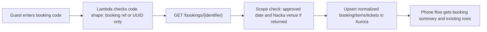

# T0171 Park-Test Lookup Mode

## Goal

Implement the first assisted park-test lookup mode for an unknown real visitor: the guest enters their booking code, JumpYard Cloud reads exactly that Roller Live booking, checks the approved park-test scope, stores the normalized snapshot in Aurora, and returns the existing booking rows to the phone flow.

This replaces the earlier exact one-booking allowlist smoke model for lookup only. It does not open add-on purchases, payment writes, redeem, webhooks, staff auth, SMS/email, or normal visitor traffic.

## Safety Model

Think of the mode as a narrow reception desk:

1. The guest must bring a booking code or Roller booking id.
2. JumpYard Cloud asks Roller for that single booking only.
3. The booking must match the approved park-test operating date.
4. The park-test Roller key is the Nacka-scoped credential; if Roller returns a venue id, Lambda also rejects anything other than `50871`.
5. Aurora stores only the normalized looked-up snapshot, not a same-day guest list.

## Runtime Gate

| Area | Value |
|---|---|
| Config file | `infra/config/park-test-assisted-lookup.json` |
| Approval phrase | `T0171_ASSISTED_LOOKUP_APPROVED` |
| CDK config keys | `safetyGates.liveAssistedLookupApproval`, `safetyGates.liveAssistedLookupAllowedOperatingDates`, `safetyGates.liveAssistedLookupVenueId` |
| Lookup Lambda env vars | `ENABLE_T0171_ASSISTED_LOOKUP`, `T0171_ASSISTED_LOOKUP_ALLOWED_OPERATING_DATES`, `T0171_ASSISTED_LOOKUP_VENUE_ID` |
| Current reviewed date window | `2026-06-29` through `2026-07-05` |
| Current reviewed venue | `50871` JumpYard Nacka Forum |
| Normal closed config | `infra/config/park-test.json` keeps this disabled |

## Flow



## Existing Add-Ons

T0171 preserves existing booking contents. If Roller returns existing booking items, add-ons, or ticket rows, the lookup normalization and Aurora upsert path keeps those rows in the returned booking snapshot.

That is different from buying new add-ons:

| Capability | T0171 state |
|---|---|
| Read existing booking rows already on the booking | Allowed while T0171 gate is open |
| Read existing ticket rows already on the booking | Allowed while T0171 gate is open |
| Create a new socks/SkyRider/lock/coffee add-on booking | Closed |
| Start payment for an add-on | Closed |
| Redeem/check in tickets | Closed |

## Implementation

- Added the T0171 assisted lookup approval phrase and config fields in `infra/lib/config.ts`.
- Added `infra/config/park-test-assisted-lookup.json`.
- Added CDK-to-Lambda env vars in `infra/lib/jumpyard-cloud-stack.ts`.
- Added lookup runtime checks in `infra/lambda/lookup/index.js`:
  - Allow T0171 lookup only for booking-reference-like numeric identifiers with 6-9 digits that do not start with `0`, or Roller UUIDs.
  - Reject name/email/phone-style free-form lookup input.
  - Validate the returned booking dates against the approved operating dates before writing Aurora.
  - Reject a mismatched Roller venue id when the response exposes one.
  - Store the approved Nacka venue id on the Aurora snapshot when Roller does not expose venue id in booking detail.
- Added config guard and synth validation coverage.
- Added `synth:park-test-assisted-lookup`, `diff:park-test-assisted-lookup`, and `deploy:park-test-assisted-lookup` npm scripts.

## Scope Safety

T0171 does not:

- Import all bookings for the day.
- Search by name, email, or phone.
- Create drafts, bookings, payments, refunds, redemptions, webhooks, SMS, or email.
- Enable public add-on writes.
- Enable staff auth.
- Change Cloudflare or frontend source.
- Deploy AWS or leave an AWS runtime gate open as part of this code change.

## Validation

Passed on 2026-06-29:

```powershell
npm --prefix infra run build
npm --prefix infra run validate:config-guards
npm --prefix infra run validate:park-test-synth
npm --prefix infra run synth:park-test-assisted-lookup
node --check infra/lambda/lookup/index.js
npm run validate
git diff --check
```

Validation notes:

- `validate:config-guards` confirmed the assisted lookup config passes only with approval phrase, operating date, and venue id present.
- Guard tests confirmed assisted lookup fails closed without dates, without venue id, with dates/venue but no approval, or when combined with payment smoke.
- `validate:park-test-synth` confirmed the assisted lookup config opens only `LookupHandler` T0171 env vars and keeps booking draft writes, add-on writes, redeem writes, staff auth, webhook processing, and guest messaging closed.
- `synth:park-test-assisted-lookup` passed and printed the expected CDK notice `37949`.
- `npm run validate` passed after `PROJECT_CONTEXT.md` was kept under the repo's active-context size rule.
- `git diff --check` passed with existing CRLF normalization warnings only.
- 2026-06-29 deploy: `npm --prefix infra run deploy:park-test-assisted-lookup` reached `UPDATE_COMPLETE`.
- Lookup Lambda readback confirmed `ENABLE_T0171_ASSISTED_LOOKUP=true`, dates `2026-06-29,2026-06-30,2026-07-01,2026-07-02,2026-07-03,2026-07-04,2026-07-05`, venue `50871`, T0160/T0165/T0169 off, and `JUMPYARD_EMERGENCY_STOP=true`.
- Booking, redeem, session, and webhook readback confirmed draft writes, add-on writes, redeem writes, staff auth, guest messaging, and webhook processing are still closed.
- API negative checks passed: email-like input was rejected with `live_lookup_not_allowed`; old booking `166490323` outside the approved date window was rejected with `live_lookup_not_allowed`.
- User office testing found real Nacka booking references during the approved window. Safe Aurora readback confirmed `166797742` saved as a fresh paid Nacka snapshot for `2026-06-29` at `12:30` with one booking item and one ticket, and `166741849` saved as a fresh paid Nacka snapshot for `2026-06-29` at `17:30` with two booking items and four tickets.

## Result

Implemented, deployed to park-test, and validated. The active deployed posture is read-only assisted lookup for `2026-06-29` through `2026-07-05`; write/redeem/webhook/staff/message gates remain closed.
