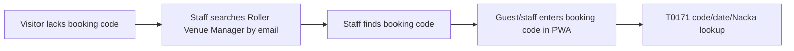

# T0172 Assisted Email Lookup

## Goal

Investigate whether the park-test PWA can safely look up an existing Roller Live booking by guest email when the visitor does not know their booking code.

## Result

T0172 is a safe blocker, not a runtime unlock.

2026-06-30 follow-up: this ticket remains the historical blocker from the time it closed, but current Roller REST documentation and a read-only Roller Live Nacka smoke later provided the supported API evidence needed for T0177. T0177 implemented and deployed the server-side contact lookup path; T0172 itself did not unlock runtime behavior.

The first park-test flow should not add public email lookup unless Roller confirms a narrow supported API contract for `email -> booking` lookup. The current approved path remains:



## Findings

| Source | Finding | T0172 Impact |
|---|---|---|
| Roller Rest API booking detail docs | `GET /bookings/{identifier}` is documented for a specific booking by unique id or booking reference. | This supports T0171 booking-code lookup, not email search. |
| Roller Rest API Search for bookings docs, checked 2026-06-30 | `GET /bookings` supports required search criteria. `date` filters booking-item date, and `keywords` searches booking name, ticket ids, guest first/last name, email, and phone. | This supplies the API contract that was missing during T0172 and should be implemented only through a later server-side scoped ticket. |
| Roller Rest API guest detail docs | `GET /guests/{id}` is documented for a specific guest id. | This supports contact resolution after a booking exposes `customerId`; it does not find bookings from email. |
| Roller API overview | Data API and Rest API serve different use cases; Rest API supports real-time workflows. | Email lookup must be a Rest API-like real-time path to be safe for the PWA. |
| Roller Data API overview | Data API is for periodic export, is not real time, and does not allow querying specific records. | Data API is not an acceptable T0172 email lookup path. It would push us toward broad guest-data import. |
| Roller Venue Manager Academy | Venue Manager can find bookings by name, booking ID, email, or phone. | Staff can use Roller UI as the assisted fallback, but UI capability is not a public API contract. |

References:

- https://docs.roller.app/docs/api/rest/operations/search-for-bookings
- https://docs.roller.app/docs/api/rest/operations/get-booking-detail
- https://docs.roller.app/docs/api/rest/operations/get-guest-detail
- https://mysupport.roller.software/hc/en-us/articles/360001653455-API-overview
- https://mysupport.roller.software/hc/en-us/articles/360001653475-Data-API
- https://academy.roller.software/vm-basics/bookings-in-the-vm

## Decision

Do not implement public guest email lookup in T0172.

Reasons:

- A public email lookup can become a guest-data enumeration surface if it returns whether an email has a booking.
- A safe lookup needs a documented Roller endpoint that can be constrained to Nacka, approved operating dates, and exact match behavior.
- Data API import would be the wrong tool for this ticket because it is broad, periodic, and not real-time.
- Using undocumented endpoints in the park-test PWA would make rollback/support harder on test day.

The missing endpoint condition was addressed by 2026-06-30 follow-up evidence, while the remaining security, same-day match selection, date filtering, and PII handling work belonged to T0177.

## Park-Test Operating Fallback

If a visitor does not know their booking code:

1. Staff searches in Roller Venue Manager by email.
2. Staff reads the booking code from Roller.
3. The visitor or staff enters that booking code into the park-test PWA.
4. T0171 handles the server-side Nacka/date-scoped lookup and Aurora snapshot.

This keeps email and broader PII inside authenticated Roller staff tooling instead of the public guest endpoint.

## 2026-06-30 Follow-Up Evidence

After T0172 closed, current Roller docs confirmed a REST search path: `GET /bookings?date=YYYY-MM-DD&keywords=<input>`. The documented `keywords` field includes guest email and phone, and the documented `date` field scopes the booking-item date.

A read-only Roller Live Nacka smoke using a user-provided real email and `date=2026-06-30` returned exactly one paid booking. The exact personal email and booking identifiers are intentionally omitted from this source-of-truth doc. The currently deployed JumpYard park-test lookup API still rejects email lookup with `live_lookup_not_allowed`, so this evidence is not a runtime unlock.

T0177 should implement the supported path through JumpYard Cloud only: accept booking reference, email, or phone; call Roller server-side; verify the selected booking through booking detail; filter to Nacka and the current Europe/Stockholm operating date; return not-found when no same-day booking matches; choose the nearest upcoming same-day start time when multiple valid bookings match; and mask PII in logs and docs.

## Future Unlock

A later ticket can implement assisted email/phone lookup because Roller has now confirmed a supported endpoint shape, but it still must satisfy these constraints:

- exact email input;
- normalized phone input;
- booking reference remains supported;
- Nacka venue only;
- approved operating date only, defaulting to the current Europe/Stockholm date for the park-test flow;
- no public list of matching guests/bookings;
- multiple same-day matches choose the nearest upcoming start time, falling back to the earliest valid start time if none are upcoming;
- generic public error text;
- audit event without printing full email;
- no payment, add-on write, redeem, webhook, SMS, or email side effects.

## Scope Safety

T0172 did not:

- call Roller Live APIs;
- call AWS or Aurora;
- create drafts, bookings, payments, refunds, redemptions, or webhooks;
- enable staff auth, webhook processing, SMS, email, add-on writes, or visitor traffic;
- expose public PII;
- change Lambda runtime behavior.

## Validation

Passed on 2026-06-29:

```powershell
npm run validate
git diff --check
```

`git diff --check` printed CRLF normalization warnings only.
